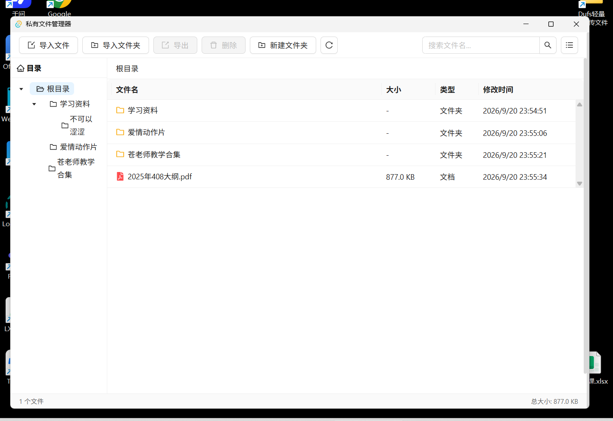
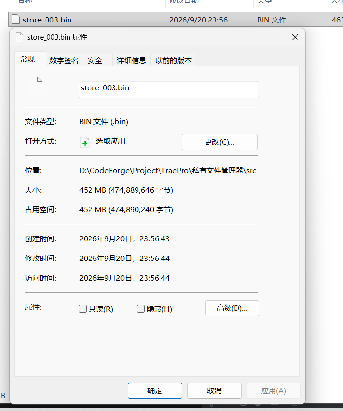

# 私有文件管理器

一款基于 Tauri v2 构建的桌面端私有文件管理工具。文件以二进制分片形式存储在独立文件中，不以原始形态出现在文件系统里，普通人无法通过资源管理器直接打开或查看。



## 功能特性

- **文件导入/导出** — 支持批量导入文件和文件夹，导出到指定目录，导入时自动保留目录结构
- **目录树导航** — 左侧文件夹树形结构，支持多层级嵌套，面包屑路径导航
- **双视图模式** — 列表视图和网格视图自由切换，网格视图支持缩略图预览
- **缩略图生成** — 图片和视频导入后自动生成缩略图（视频通过 ffmpeg 截取）
- **文件操作** — 新建文件夹、重命名、删除、拖拽移动、框选批量操作
- **右键菜单** — 打开、重命名、删除、导出等快捷操作
- **文件搜索** — 按文件名关键字搜索，跨文件夹查找
- **系统程序调用** — 双击文件自动提取到临时目录，调用系统默认程序打开
- **二进制分片存储** — 文件数据按块写入无扩展名的分片文件，元数据存于 SQLite

## 技术栈

| 模块 | 技术 |
|---|---|
| 桌面框架 | [Tauri v2](https://tauri.app/) |
| 前端 | React 19 + TypeScript |
| UI 组件 | [Ant Design 6](https://ant.design/) |
| 后端 | Rust |
| 数据库 | SQLite (rusqlite) |
| 缩略图 | image crate + ffmpeg |
| 构建工具 | Vite |

## 存储架构

采用元数据与二进制数据分离的设计：

```
pfm_data/
  metadata.db          # SQLite 元数据数据库
  store/
    store_001.bin      # 二进制分片文件（最大 2GB）
    store_002.bin
    ...
  thumb_cache/
    img/{file_id}.webp # 图片缩略图
    vid/{file_id}.webp # 视频缩略图
  temp/                # 临时文件目录
```

- SQLite 仅存储文件元数据和 chunk 位置索引（偏移量、长度）
- 实际二进制数据存储在独立的分片文件中，每个分片最大 2GB
- 删除文件后空间标记回收，支持空间复用

**数据不可见**：所有文件内容以二进制分片形式混合存储在 `.bin` 文件中，无扩展名、无文件头标识，多个文件的数据交错拼接在同一分片内。即使直接打开分片文件，也只能看到无法解析的乱码，无法还原出原始文件，普通人无法通过任何常规手段查看或提取内容。



## 开发

### 环境要求

- [Node.js](https://nodejs.org/) >= 18
- [Rust](https://www.rust-lang.org/tools/install) (stable)
- [ffmpeg](https://ffmpeg.org/) — 视频缩略图生成（项目会通过 ffmpeg-sidecar 自动下载）

### 安装依赖

```bash
npm install
```

### 开发模式

```bash
npm run tauri dev
```

### 构建发布

```bash
npm run tauri build
```

### 推荐 IDE

[VS Code](https://code.visualstudio.com/) + [Tauri](https://marketplace.visualstudio.com/items?itemName=tauri-apps.tauri-vscode) + [rust-analyzer](https://marketplace.visualstudio.com/items?itemName=rust-lang.rust-analyzer)

## 项目结构

```
├── src/                    # 前端源码
│   ├── App.tsx             # 主界面组件
│   ├── App.css             # 样式
│   └── main.tsx            # 入口
├── src-tauri/              # Rust 后端
│   ├── src/
│   │   ├── lib.rs          # Tauri 命令注册
│   │   ├── db.rs           # SQLite 数据库操作
│   │   ├── models.rs       # 数据模型
│   │   └── storage.rs      # 分片存储与文件读写
│   ├── Cargo.toml
│   └── tauri.conf.json
├── assets/                 # 项目资源
└── package.json
```

## 许可证

[MIT License](LICENSE) — Copyright (c) 2026 思渡鸢
